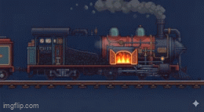

Railway Game – Scene & Door Teleport System

A simple Unity 2D project demonstrating scene transitions and teleporting the player between a Locomotive scene and a Kitchen Wagon scene.

Features

Door-based scene transitions

Player automatically spawns at the correct location in the new scene

Easy to add more doors and scenes

Setup

Locomotive Scene

Add a door object with BoxCollider2D (IsTrigger enabled)

Attach the DoorSceneChange script and set sceneName to the target scene

Make sure the player GameObject has the tag Player

Kitchen Scene

Create an empty GameObject called PlayerSpawn at the desired player position

Create an empty GameObject called SpawnManager and attach the SpawnManager script

Assign PlayerSpawn to the spawnPoint field in the inspector

How it Works

Player collides with the door → new scene loads

SpawnManager moves the player to the spawn point in the new scene

Scripts

DoorSceneChange.cs → Handles scene loading when player enters a door

SpawnManager.cs → Moves the player to the spawn point in the scene

Notes

Player must have the tag Player

Only one player object is expected in the scene
